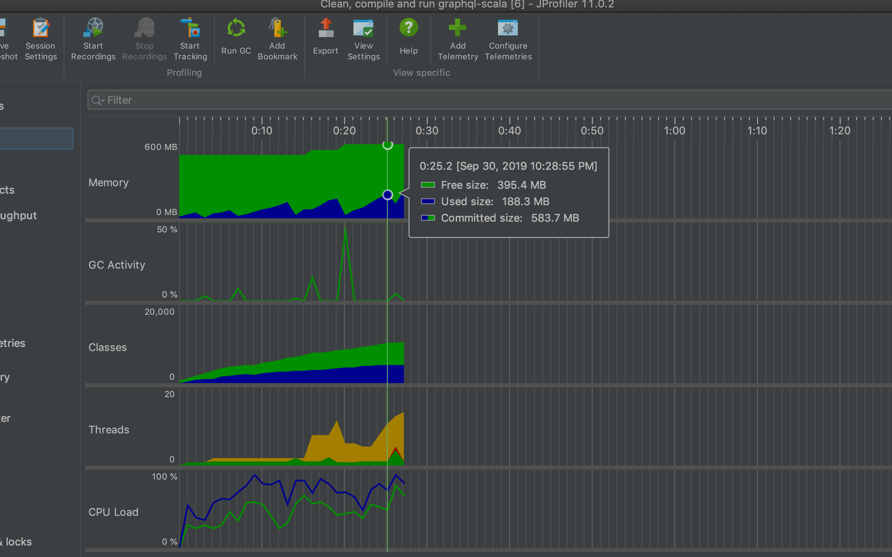
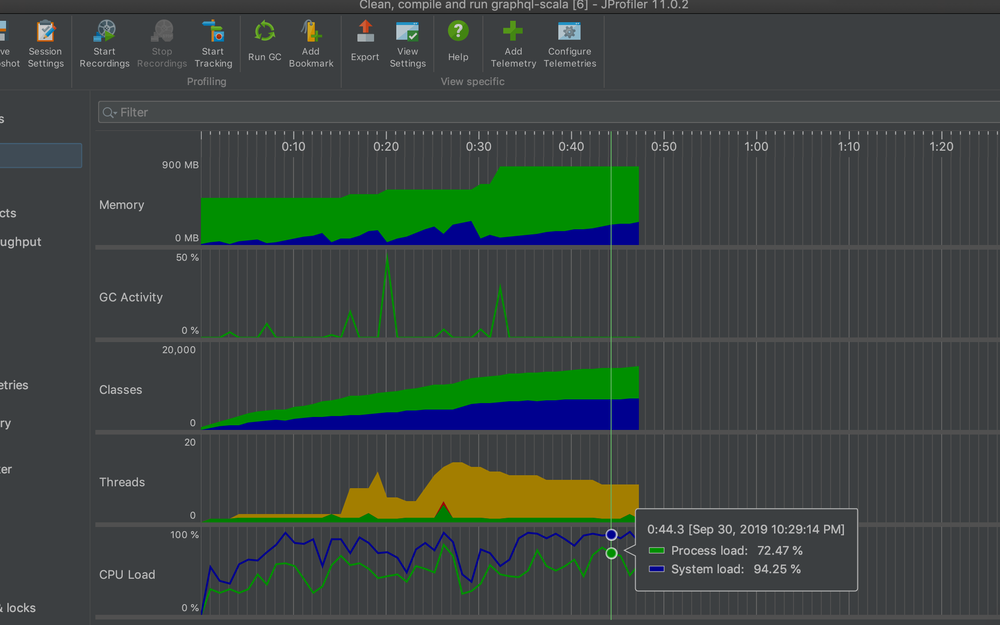
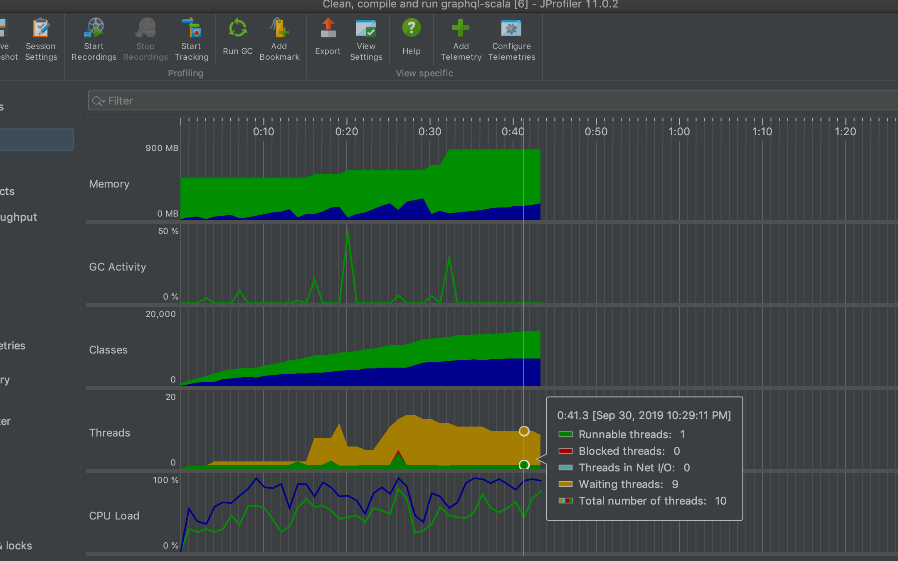
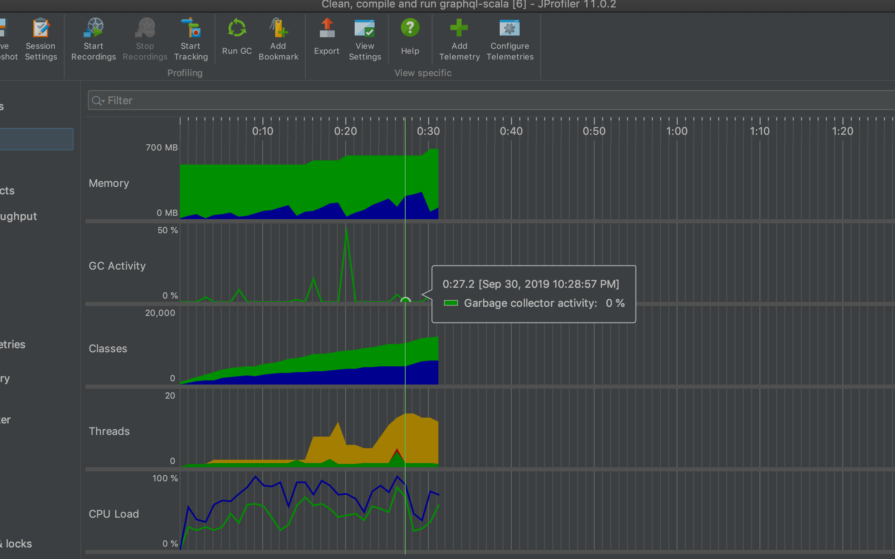

## CS 474: Object Oriented Languages and Environments
Homework 1: A GraphQL Client for GitHub's v4 REST API
---
Name: Abhijeet Mohanty
---
### Objective

The objective of this homework is to form GraphQL queries so as to 
slice and dice the Github schema and to define models which store the responses
of these queries. 

### Instructions

#### Development Environment

The project was developed using the following environment:

- **OS:** macOs Mojave 
- **IDE:** IntelliJ IDEA Ultimate 2018.2


#### Prerequisites

- [Scala 2.12](https://www.javahelps.com/2018/12/setup-scala-on-intellij-idea.html) and [SBT 1.0](https://medium.com/@mattroberts297/using-scala-sbt-and-intellij-idea-c05857daedbd)

#### Running the application

- Navigate to the module **<parent_project>/graphql-client**  and then execute the following command :-
    ```
    sbt clean compile testOnly run
    ```

### About the application

#### Code flow overview

- `GithubGraphQLRunner` is the starting point of the application which passes GraphQL queries specified
in the `queries.conf` file.
- These queries are passed one at a time to the `GithubGraphQLClient` which builds the request object with the 
help of paramters defined in the `application.conf` file to hit
GitHub's endpoint.
- Once the response objects have been obtained and de-serialized into a instances which implement the `Data` interface,
the contents of these objects are displayed with the help of loggers.


#### Github models used

- #### Viewer

    This is an example of a simple GraphQL query which fetches the **Viewer** related information from GitHub.

    ```
    query {
      viewer {
        login
        name
      }
    }
    ```
    This is the response which is returned in **json** format.
    
    ```
    {
      "data": {
        "viewer": {
          "login": "jeet1995",
          "name": "Abhijeet Mohanty"
        }
      }
    }
    ```
- #### Repository

    Here we fetch **Repository** information based on the **Owner** along with fetching **Commit** related information.
    
    ```
    query($owner_name: String!, $repository_name: String!){
    	repository(owner: $owner_name, name: $repository_name){
        forkCount
        createdAt
        codeOfConduct{
          body
        }
        
        commitComments(first: 7) {
          nodes{
            author{
              login
            }
          }
        }
       owner{
        login
      }
        licenseInfo{
          body
        }
      }
    }
    ```
    
    We define an input through another **json** structure such as below :
    
    ```
    {
      "owner_name": "uber",
      "repository_name": "react-vis"
    }
    ```
    
    And finally the response :
    
    ```
    {
      "data": {
        "repository": {
          "forkCount": 630,
          "createdAt": "2016-02-22T20:45:50Z",
          "commitComments": {
            "nodes": [
              {
                "author": {
                  "login": "bulyonov"
                }
              },
              {
                "author": {
                  "login": "fastfrwrd"
                }
              },
              {
                "author": {
                  "login": "fastfrwrd"
                }
              },
              {
                "author": {
                  "login": "fastfrwrd"
                }
              },
              {
                "author": {
                  "login": "roderickhsiao"
                }
              },
              {
                "author": {
                  "login": "roderickhsiao"
                }
              },
              {
                "author": {
                  "login": "balthazar"
                }
              }
            ]
          },
          "owner": {
            "login": "uber"
          }
        }
      }
    }
    ```
#### Design patterns used

- #####Abstract factory pattern : 

This particular design pattern is used to create instances of the `Viewer` and `Repository` classes which
are a slicing of the GitHub's schema. The `Datafactory` class which implements the `AbstractFactory` creates
instances of an implementation of the `Data` - `Viewer` and `Repository` being examples of it.

- #####Observer pattern :

This particular design pattern is used by the `QueryLogger` class which is the observer on the subject which is 
the `QueryExecutor`. Each time a query execution is about to run, `QueryLogger` class observes the subject and 
logs a message. 

- #####Facade pattern :

Here the `GraphQLClientRunner` class behaves as a facade to the `GraphQLClient` class which consists of the 
deeper details as far as the execution of the application is concerned be it execution of queries or 
printing response data information.

#### CPU and RAM usage information

For this purpose, the JProfiler tool was used which produced results as shown below :


- Memory

- Process load

- Thread

- Garbage Collection

